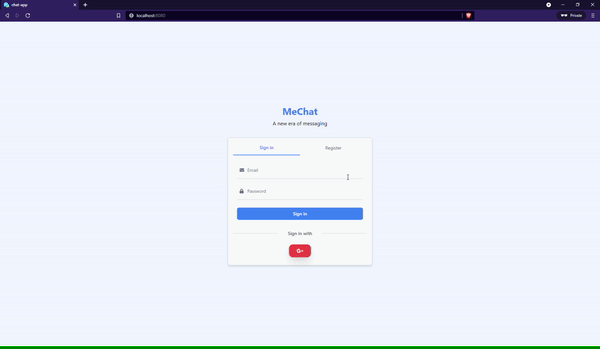
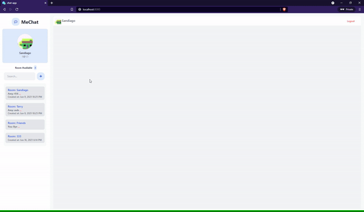
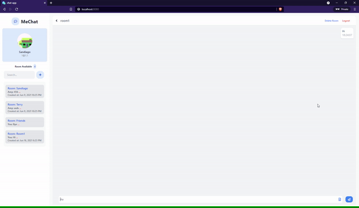

<h1 align="center">

    <br>
    MeChat
</h1>

<h4 align="center">
Contact me at <a href="mailto:binhdlt.work@gmail.com">mail</a> to about more.
</h4>

<h4 align="center">
MeChat web app layout. 
</h4>

<br>
<p align="center">
 <br>
</p>
<br>
<p align="center">
  Under login screens
</p>

<p align="center">
 <br>
   
  
</p>

# chat-app

    This project wrote in VueJS, Firebase, Tailwind

## Create a environment variable

### Create a .env file in your root directory

```
VUE_APP_APIKEY=apiKey
VUE_APP_AUTH_DOMAIN=projectId.firebaseapp.com
VUE_APP_DATABASE_URL=https://databaseName.firebaseio.com
VUE_APP_PROJECT_ID=projectId
VUE_APP_STORAGE_BUCKET=bucket.appspot.com
VUE_APP_MESSAGING_SENDER_ID=messaingSenderId
VUE_APP_APP_ID=appId
VUE_APP_MEASUREMENT_ID=measurementId
```

## Project setup

```
npm install
```

### Compiles and hot-reloads for development

```
npm run serve
```

### Compiles and minifies for production

```
npm run build
```

### Lints and fixes files

```
npm run lint
```

### Customize configuration

See [Configuration Reference](https://cli.vuejs.org/config/).
